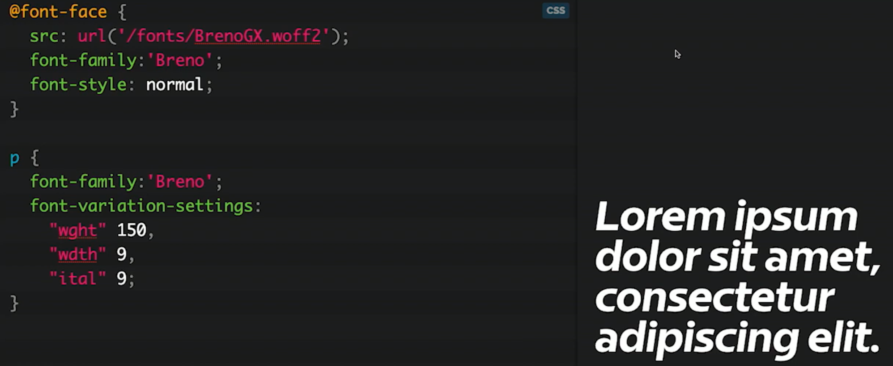

<!--  Reglas generales -->

# Codemotion 2019

#### Mimacom|Flowable expedition selected notes & things we learned

---

<!-- Jorge -->

#### Thinking like a Founder - Chad Arimura

- Lorem ipsum dolor sit amet, consectetur adipiscing elit.
- Mauris suscipit luctus volutpat.
- Maecenas at lacus nec velit bibendum ullamcorper.
- Lorem ipsum dolor sit amet, consectetur adipiscing elit.
- Mauris suscipit luctus volutpat.
- Maecenas at lacus nec velit bibendum ullamcorper.

---

#### Taking Back “Software Engineering” - Dave Farley

- Lorem ipsum dolor sit amet, consectetur adipiscing elit.
- Mauris suscipit luctus volutpat.
- Maecenas at lacus nec velit bibendum ullamcorper.

---

#### The Future of Serverless Java - Chad Arimura

- Lorem ipsum dolor sit amet, consectetur adipiscing elit.
- Mauris suscipit luctus volutpat.
- Maecenas at lacus nec velit bibendum ullamcorper.

---

<!-- Victor -->

#### ¡GraalVM y Micronaut: compañeros perfectos! - Iván López (El simpático)

- GraalVM: VM políglota de Oracle
- Sin reflexión ni runtime proxies
  

---

#### Descubriendo Quarkus, java sub-atómico en acción - Katia Aresti y Aurea Amunozhe

- Quakus 1.0.0 Final --> 25 de Noviembre 2019
- Container First
- Standards-based (RESTEasy and JAX-RS, Hibernate ORM and JPA, Netty, Eclipse Vert.x, Eclipse MicroProfile, Apache Camel, Spring, etc)
- Microservice First: Fast startup time and code turn around to Java apps

---

#### Descubriendo Quarkus, java sub-atómico en acción - Katia Aresti y Aurea Amunozhe

---

#### El futuro era esto: Reconocimiento facial sobre video en tiempo real sin servidores - Javier Ramirez

- AWS Rekognition
- Análisis de imágenes, videos y reconocimiento facial 
  

---

<!-- Javi Ruiz -->

## Lo nuevo de CSS (Sonia Ruiz)

---

#### Presente

|                                                                                                                                       |                                              |
| :------------------------------------------------------------------------------------------------------------------------------------ | :------------------------------------------- |
| **Custom Properties**                                                                                                                 |                                              |
| Variables en css                                                                                                                      |  |
| **Calc**                                                                                                                              |                                              |
| Calculo entre distintas tipos de medidas.  En un futuro se agregarán:  max(), min(), clamp()  y funciones trigonométricas |               |
| **Conic Gradients**                                                                                                                   |                                              |
| Hacer un pie chart solo con css 70% de compatibilidad en navegadores                                                              |              |

---

#### Futuro

|                                                                                                      |                                     |
| :--------------------------------------------------------------------------------------------------- | :---------------------------------- |
| **Custom Selectors**                                                                                 |                                     |
| Damos formato a todos los parrafos hijos  de encabezados del 1 al 6                              |  |
| **Scroll Snap**                                                                                      |                                     |
| Sliders con css, para pc o movil                                                                     |    |
| **Pseudo Clases**                                                                                    | Selectores según tipos y estado     |
| **Has**                                                                                              |                                     |
| Seleccionamos todos los elementos enlace  que tengan como hijo directo una imágen                |        |
| **Is**                                                                                               |                                     |
| Seleccionamos todos los parrafos que tenga  como padre un elemento de clase header, main, footer |         |
| **Not**                                                                                              |                                     |
| Seleccionamos todos los elementos li que no  tengan la clase moreinfo                            |         |

---

|                                                                                                                                             |                                    |
| :------------------------------------------------------------------------------------------------------------------------------------------ | :--------------------------------- |
| **Sticky**                                                                                                                                  |                                    |
| Fijar un elemento en pantalla, hasta que  aparezca otro con posicionamiento sticky.  Tambien sirve para la fila header de una tabla |   |
| **Fuentes variables**                                                                                                                       |                                    |
| Con un único archivo de fuente, tenemos los textos con apariencias de fuente distintos                                                      |  |

---

###### Todas estas propiedades son muy chulas, pero todavía no están 100% soportadas por todos los navegadores.

###### Os aconsejo consultarlas antes de usarlas en:

###### <https://caniuse.com/#home>

|                                                                  |                                     |
| :--------------------------------------------------------------- | :---------------------------------- |
| **Feature Queries**                                              |                                     |
| Para aplicar estilos según sean o no soportados por el navegador |  |

---

###### Para conocer que más cosas tendremos a futuro visitad:

<http://cssdb.org>

---

<!-- Alex -->

#### Interfaces en tiempo real con Angular y Redux - Antonio Pérez y Manuel Maldonado

- Típicos problemas en aplicaciones frontend
- Patrón Flux:
  - Store como única fuente de verdad
  - Acciones como reglas para cambiar el estado del Store
- Valoración del uso de Redux en un proyecto

---

#### Interfaces en tiempo real con Angular y Redux - Antonio Pérez y Manuel Maldonado

- Ejemplo práctico del uso en Angular con NgRx con múltiples fuentes de datos
  - Módulos
  - Estructura recomendada
  - Acciones -> Efectos -> Acciones

---

#### How to build Javascript-powered Smartglasses - Ruben van der Leun

- Smartglasses / Vuzix prototype
- Motivación
- 3 elementos hardware:
  - Vufine
  - Raspberri Pi
  - Powerbank

---

#### How to build Javascript-powered Smartglasses - Ruben van der Leun

- Software: Rubeye platform connected with a Webapp
- Demo: navegador, cámara, Youtube, GoogleMaps, Face-Recognition
- Conclusiones
- Nuevos retos

---

#### Are Web Components the Betamax of Web Development? - Horacio Gonzalez

- Concepto de Componente Web (W3C)
  - Elementos customizados
  - Shadow DOM
  - Plantilla
- Historia Betamax

---

#### Are Web Components the Betamax of Web Development? - Horacio Gonzalez

- Componentes Web compatibles con todos los navegadores
- Ionic
  - AngularJS -> Angular
  - Stencil
- Polymer, deprecated?
- Los componentes web valen la pensa, son el estándar

---

#### React hooks, bye bye to classes - Carlos P. Jimeno

- Hooks:
  - useState (Toggle)
  - useEffect (Scroll)
  - useContext (Theme)
- Powerful useReducer + useContext combination
- Custom hooks:
  - useChecked
  - useArray

---

#### React hooks, bye bye to classes - ~~Carlos P. Jimeno~~ Victor Ibáñez

---

<!-- Juan Carlos -->

#### Building Reactive Pipelines - Mark Heckler

- Procesamiento de datos asíncrono, no bloqueante y orientado a eventos
- Reactive Stream API
- Reactive Cloud Stream (requiere una cola de mensajería: Kafka, RabbitMQ)
- Publisher<T>, Processor<T,R>, Subscriber<T>, Subscription.
- Mono vs Flux

---

#### Building Reactive Pipelines - Mark Heckler

- Publisher @EnableBinding(Source.class)
- Processor @EnableBinding(Processor.class)
- Subscriber @EnableBinding(Sink.class)

---

#### One Click Development Environments - Pablo Chico de Guzman

- Entorno de desarrollo: replicable, integrado, rápido

|             | Replicable | Integrado | Rápido |
| ----------- | ---------- | --------- | ------ |
| **Local**   | NO         | NO        | SÍ     |
| **Vagrant** | SÍ         | SÍ        | NO     |
| **Docker**  | SÍ         | SÍ        | NO     |

---

#### One Click Development Environments - Pablo Chico de Guzman

- Cloud Native Development: pod mutables, cambio de imagen local en el pod
  - Sincronización código desde el propio editor en local hasta el pod

|                  | Replicable | Integrado | Rápido |
| ---------------- | ---------- | --------- | ------ |
| **Cloud Native** | SÍ         | SÍ        | SÍ     |

- Visual Studio Code Remote development

---

<!-- Javier del Águila -->

#### Tips para mejorar la gestión de tu tiempo

**Adolfo Sanz De Diego**

- Creador de una comunidad, organizador de hackathones, profesor de universidad, imparte cursos de tecnología, asesor técnico y padre de dos hijas

---

#### Planificar

- Lista Tareas: Cortas, concretas y agendables
- **Agendar** y poner alarmas

|                   | Urgente | No Urgente |
| ----------------- | ------- | ---------- |
| **Importante**    | Hazlo!  | Agéndalo   |
| **No Importante** | Delega  | Olvida     |

---

#### Consejos

- Si <2 min hazlo
- Aprende a decir que no (O posponer)
- Conoce tus herramientas
- Orden
- Automatizar: scripts, filtros de email, etc..

---

#### Distracciones

- Darse de baja de listas de correo
- Redes sociales cerradas
- Cerrar pestañas que no utilicemos
- Primero lo primero/importante
- Regla de los 5 segundos

---

#### Interrupciones

- Modo no molestar en móvil y pc
- Correo 2/3 veces al día
- Una cosa a la vez
- Mejor una llamada que un mail
- Cascos
- Reuniones <1h con agenda clara

---

#### Perfectionism, Impostor Syndrome and Anxiety - Understanding your fears and learning to be kind to yourself

**Jo Franchetti**

---

#### Sindrome del impostor

- Sensación de que los demás son mejores que tú
- Miedo a pedir ayuda por parecer ignorante
- Pánico a justificar en el daily tu trabajo diario -> sobreesfuerzo
- Sensación de que no mereces estar donde estás y de que van a descubrir que eres un fraude
- Miedo a colaborar en un proyecto opensource por no estar al nivel

---

#### Perfeccionismo

- Autoexigirse un nivel inalcanzable
- Preocupación por lo que piensen los demás
- "Bastante bien" no es suficiente
- Miedo a entregar un trabajo porque alguien pueda encontrar un error
- Dejar cosas inacabadas por no conseguir exáctamente lo que se pretendía en un principio
- Pedir ayuda es no ser perfecto

---

#### Consejos

- "Perfecto" es un enemigo de "muy bien"
- Pedir ayuda te hace mejorar y ahorrar tiempo
- Nadie te va a criticar más que tú mismo
- Si alguien encuentra un error, es una oportunidad para aprender
- Hablar de tus problemas y ayudar a los demás

---

_"We learn most when reality does NOT match our predictions"_

**Dave Farley**

---

#### Wrap-up

- PLEASE, APORTAD AQUÍ VUESTRAS CONCLUSIONES

---

# <!--fit--> :+1:
