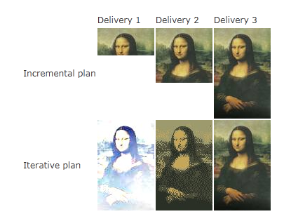
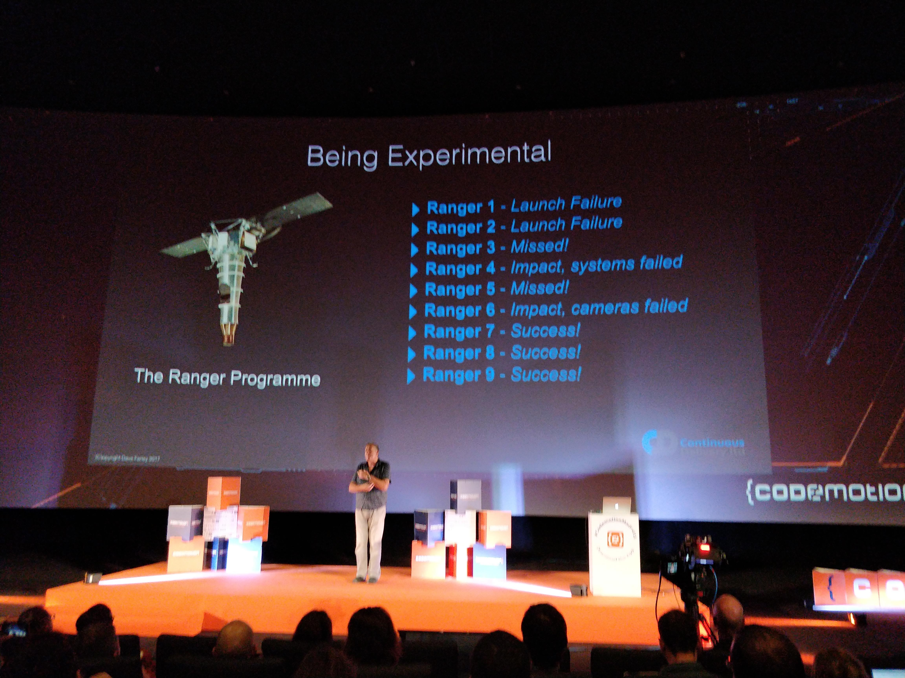
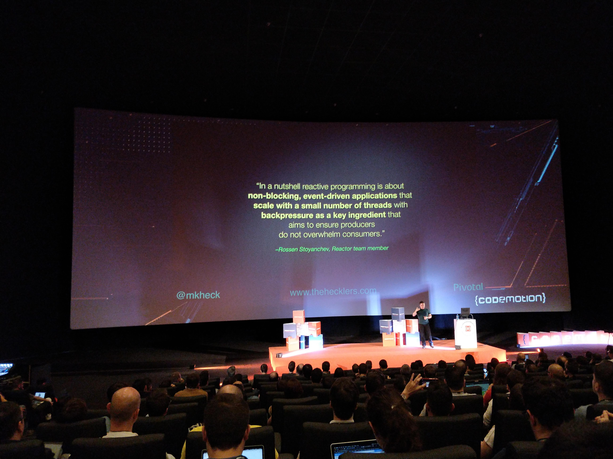
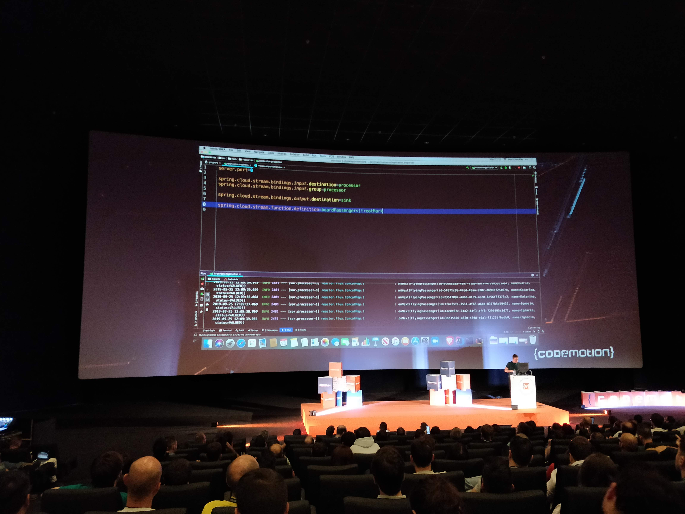
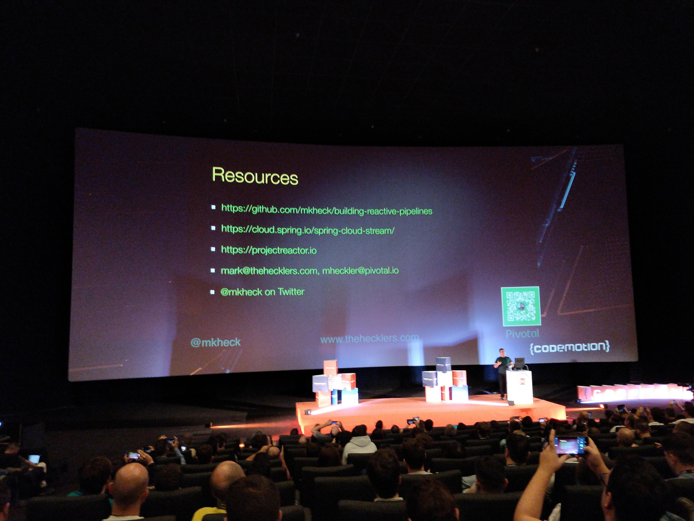

# Codemotion 2019 Notes

Notes about the conference. Just the highlights. Zero fat.

## September 24 - Tuesday

### Thinking like a Founder - Chad Arimura

#### Asistentes

  - Jorge Mora  - **Quiero hablar de esta presentación**
  - ...

#### Jorge's notes

- CEO's functions:
  - People
    - Choose wisely and empower your team
  - Vision
    - Just a north star
  - Capital
    - Fear the treadmill
- Culture
  - YOU are the culture. Less words. Acts.
  - Shitty or incoherent culture brings a shitty incoherent company.

### Speeding up Innovation - Arun Gupta

#### Asistentes

  - Jorge Mora
  - ...

#### Jorge's notes

- "You don't hire a VP of innovation."
- "There is no economy of scale in software". In other words, 1000 crappy programmers don't make a good software project just because they are many whether or not they are very well organized.
- Cloud Native
  - Self service. No waiting. (No Jira tickets).
- Diversity in software is good to avoid epidemic errors. This is valid for software and for people.
- The "availability theather", that is, pretending that your application is highly available just because you have a DR that you have never tested properly. PRACTICE FAILOVER.
- "YOU CANNOT PREDICT FAILURE. FAILURE HAPPENS." Be prepared for that. The answer is "Chaos engineering".

### The Reactive Revolution - Josh Long

- [Talk source code](https://github.com/joshlong/reactive-revolution)
- [Reactive Spring Book](http://www.reactivespring.io/)
- [Reactive Streams spec](http://www.reactive-streams.org/)
- [RSocket](http://rsocket.io/)
- Reactive means disconnecting the thread that got the request from the thread that will return the response. Let the system do other things meanwhile.
- "Make jar, not war!"
- "Java 8 is morally bad"
- Let the client control the flow
- Router function to declare endpoints

### The Future of Serverless Java - Chad Arimura

- 80% of the world is using Java
- But Java is not popular in serverless environments
- And the trend is quite bad
- Java optimizations for serverless applications
  - Class Data Sharing (JVM Enhancement)
  - [Project Portola](https://openjdk.java.net/projects/portola/), a port of the JDK to the Alpine Linux distribution.
  - [SubstrateVM](https://github.com/oracle/graal/tree/master/substratevm), a framework that allows ahead-of-time (AOT) compilation of Java applications.
  - [jlink](https://docs.oracle.com/javase/9/tools/jlink.htm), a tool to create reduced JDKs
  - JDK 10+ provides better integration with containers (recognizes cgroup limits)
  - Language improvments
    - Less ceremony
      - var
      - Text blocks with """
      - switch expressions
  - Simplified native code access with [Project Panama](https://openjdk.java.net/projects/panama/)

### Artificial Stupidity - Alex Fernández

- Just a funny talk about artificial intelligence

### One Click Development Environments - Pablo Chico de Guzman

- [Okteto](https://okteto.com/) - K8s for developers
- People does not develop with docker or k8s. People uses native development and docker just for dependencies.
- Good app to demonstrate the use of k8s: [Hipster Shop: Cloud-Native Microservices Demo Application](https://github.com/GoogleCloudPlatform/microservices-demo)
- To enable Cloud Native Development:
  - Mutable pods. YES, mutable. To sync code.
  - Development images with development tools included
- [VS Code Server](https://github.com/cdr/code-server)
- Also good to develop in a remote cloud environment

### Descubriendo Quarkus, java sub-atómico en acción - Katia Aresti y Aurea Amunozhe

- [Quarkus](https://quarkus.io/) is a new thing. Not yet ready for production.
- microservices and serverless environment for Java EE people
- Includes hot reloading!
- Includes both reactive and imperative programming
- Bootstrap with an archetype
- Quarkus is based in many projects to provide functionality (REST, Vert.x, Netty, etc. )
- Direct rivals of Spring Boot. No integration foreseen.
- Demo: [Harry Potter Quarkus](https://github.com/infinispan-demos/harry-potter-quarkus)

### El futuro era esto: Reconocimiento facial sobre video en tiempo real sin servidores - Javier Ramirez

- [Amazon Rekognition](https://aws.amazon.com/es/rekognition/)
- [Amazon Kinesis Video Stream](https://aws.amazon.com/es/kinesis/video-streams/)
- Don't be evil using this technology

### Dev Tools para Kubernetes - Pablo Chico de Guzman y Micael Gallego Carrillo

- Optimizations to enable developing in a K8s environment
  - [JIB](https://github.com/GoogleContainerTools/jib) to create optimized docker images for development
  - [Okteto](https://okteto.com/) - K8s for developers
    - Hot reloading of java classes in the k8s container
  - Other tools
    - [Telepresence](https://www.telepresence.io/)
    - [KubeFwd](https://kubefwd.com/)

## September 25 - Wednesday

### Taking Back “Software Engineering” by Dave Farley

- "UML is only a tool. It's not engineering"
- Solid disciplines are made with solid principles
- SCRUM is project management stuff. It's not SE. There is no word about coding in the SCRUM spec.
- Craftsmanship
  - Production is not a problem (we simply copy bytes to deliver a product). The problem is design.
- Software industry
  - Craft <-- We are here
  - Mass production <-- WRONG
  - Lean production techniques <-- We WANT to be here (but we are not here yet)
- We are always building the fist bridge, the first rocket, etc.
- The scale of what we build varies a lot (hut vs. skyscraper)
- Dave's definition of engineering
  - **Engineering** is the application of an empirical, scientific approach to finding efficient solutions to practical problems.
- Fundamentals of the engineering approach:
  - Iterative
  - Employs feedback
  - Incremental
  - Experimental
  - Empirical
- Iterative vs. Incremental  

- The most expensive user story: "As the President of the U.S.A. I want to send a man to the moon before the end of this decade". JFK 1961.
- If you have a BIG challenge, you have to be experimental. Waterfall was not an option to send a man to the moon.
- The first engineer. 🙇🏻‍  

- Experimentation and learning: The Ranger Programme (to "hit" the moon)  

- Just guessing is not good enough. You have to measure it!
- Be empirical
- Continuous delivery as an engineering principle
- Don't be _like_ engineers. **Be** engineers.

### Building Reactive Pipelines: How to go from scalable apps to (ridiculously) scalable systems - Mark Heckler

- Definition of reactive programming  

- [Spring Cloud Stream](https://spring.io/projects/spring-cloud-stream)
- Connecting two processors with configuration 😮

- Resources  

  
### Midiendo la calidad de código en WTF/min (con ejemplos de código real que... - David Gómez

- Funny talk about crappy code. 😂
- Highly inspired by Clean Code by Uncle Bob

### ¡GraalVM y Micronaut: compañeros perfectos! - Iván López (el humilde)

- Micronaut was designed to take advantage of AOT instead of reflection and other non-friendly GraalVM techniques.

### Operational Serverless - Vicenç García Altés

### React hooks, bye bye to classes - ~~Victor Ibáñez Aparicio~~ Carlos P. Jimeno

- Super cool talk to get to know React Hooks in 40 min. 👏🏻
- [Slides](https://slides.com/carlosperezjimeno/reacthooks#/)

## Wrap-up

- Unbalanced talks. Some of them very good with international speakers, some very poor. Luckily, the poor ones were the few.
- Overall, a very well organized conference. Watching the conferences in a cinema was great.
- Most popular technologies:
  - K8
  - Serverless
  - Reactive programming
  - ML

