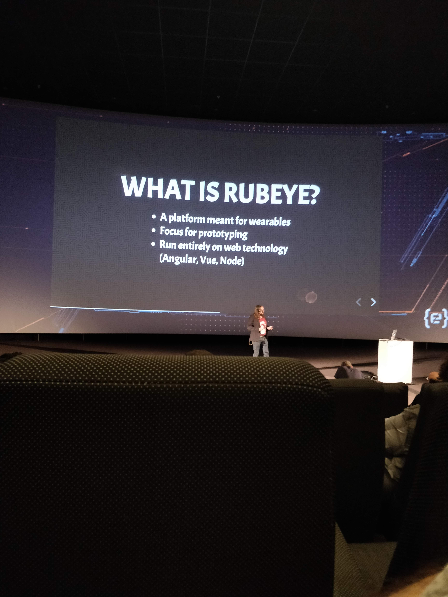
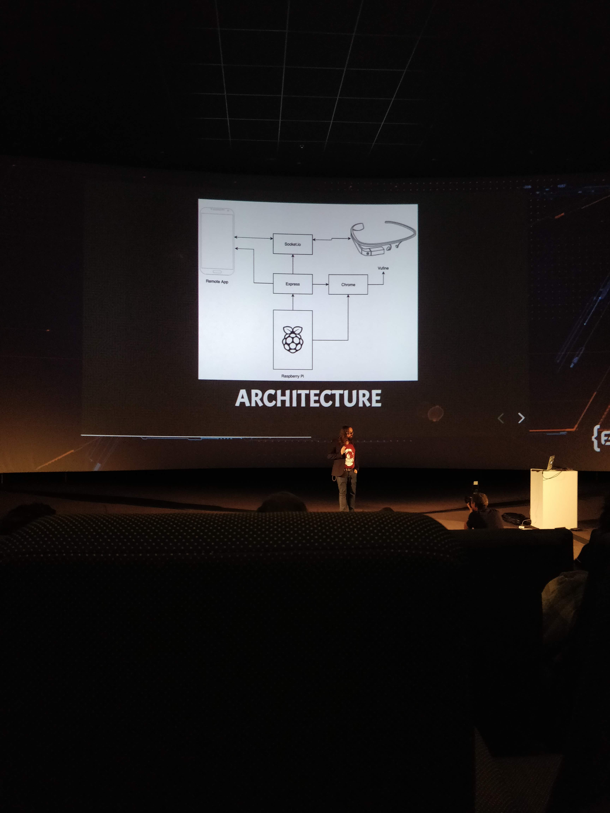

# Codemotion 2019 - Alex’s talks

## September 24 - Tuesday

### The Reactive Revolution - Josh Long @starbuxxman (Pivotal)

Jorge’s notes

### Interfaces en tiempo real con Angular y Redux - Antonio Pérez y Manuel Maldonado @apcano1978 (Digital 55)

- Caso práctico para explicar el uso del patrón Redux en una aplicación Angular, con la librería NgRx
- Defensa del patrón redux frente a los típicos problemas en una aplicación frontend:
  - número de componentes
  - variables
  - eventos entre componentes
  - múltiples fuentes de datos
  - eventos en tiempo real
  - problemas derivados de la asincronía
- Concepto de store, actions y reducers
- Ejemplo de uso del patrón en un CRUD con websocket incoming events
- Importancia de la organización adecuada de los ficheros/carpetas

### Artificial Stupidity

- https://www.youtube.com/watch?v=onWPbopwq1o

### Kotlin Multiplatform - David González (Mixtiles) - @dggonzalez

Compartir código entre distintas plataformas es una técnica muy común y necesaria en muchos proyectos, pero puede ser muy difícil sin las APIs que directamente nos proporcionan iOS y Android. Las librerías de Kotlin Multiplatform pueden usarse justamente para eso, para construir ricas APIs en un lenguaje común: Kotlin.

- Estructura de un proyecto: carpeta Android, carpeta iOS, carpeta Shared.
- Construir un proyecto Kotlin desde Android Studio mucho más sencillo y rápido que con XCode (uso de plugins para hacer los builds)
- En Xcode no se puede depurar, aunque hay un par de plugins que ayudan a tracear el código ejecutado
- Para la capa de vista, misma idea: interfaz de vista común, pero implementación nativa.
- https://www.youtube.com/watch?v=Gw4JpRJQVXA

Conclusión: Kotlin puede ser una buena solución para grandes proyectos en los que se tenga aplicaciones iOS y Android nativas

### One Click Development Environments - Pablo Chico de Guzman

Jorge’s notes + https://www.youtube.com/watch?v=c-iiDwXsI5M

### Descubriendo Quarkus, java sub-atómico en acción - Katia Aresti y Aurea Amunozhe

Jorge’s notes + https://www.youtube.com/watch?v=Vv7irtGWokg

### How to build Javascript-powered Smartglasses (without any soldering knowledge) - Ruben van der Leun (Leunix) @rvdleun

- Tras usar Vuzix (una especie de Google-glass), quiso crearse su propia versión low-cost.
- Vufine (https://store.vufine.com/) conectado a una powerbank y a una Raspberry Pi
- Rubeye - platform meant for wearables -> Internet research without success
- App mobile sincronizada con las gafas para reconocimiento de personas (star wars characters), YouTube, Google maps

- Conclusiones: producción inviable, mucho tiempo invertido, útil para hacer prototipos
  
  

### GITTogether: Front(end) to the backend - Beatriz De Miguel Pérez (Kairos DS) @\_beademiguel

- Ejemplo de cómo, con NodeJS se puede crear un backend con javascript.
- Arquitectura backend MVC
- App front con Express y bbdd MongoDB
- https://www.youtube.com/watch?v=4irv0ZswJu4&feature=youtu.be

## September 25 - Wednesday

### Are Web Components the Betamax of Web Development? - Horacio Gonzalez (OVH) @LostInBrittany

- Betamax history
- Comparison between Vue, Angular and Vue
- Ionic 4 / Stencil or Polymer as a solution nowadays
- Webcomponent are based in the low level html standard
- https://www.youtube.com/watch?v=mz1yL4HJhAA

### Visualización de Datos Interactiva en aplicaciones con Vue.js y React - Javier Abadía (StyleSage) @javierabadia

- Gráficas solo con D3, solo con Vue o solo con React. Posibilidad de combinarlos
- Para animar sólo con Vue o React, se necesitan librerías externas
- Eventos: hover
- Cosas a tener en cuenta en gráficas responsive

### Web Scrapping como nunca te lo contaron. Atajos y técnicas de Evasión de contramedidas - Jorge Barrachina (ESRI) @NTKOG

- Notas legales de introducción a qué se puede scrapear
- Bots
- Parallel & Puppeteer como herramientas principales para scrapear
- Otra charla demasiado teórica y moral

### Afrontando el mal software - César Alberca (Autentia) @cesalberca

- Principios SOLID
- Patrones de diseño: comando, decoradores, cadena de responsabilidad
- Charla muy para juniors
- https://www.youtube.com/watch?v=ZIM_cWP-SRA

### React hooks, bye bye to classes - Carlos P. Jimeno (influencity)

- Slides: https://slides.com/carlosperezjimeno/reacthooks#/
- 
